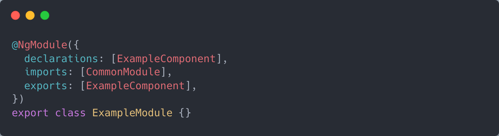
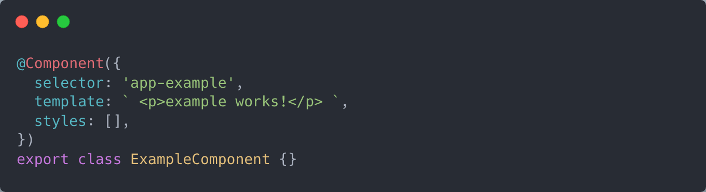
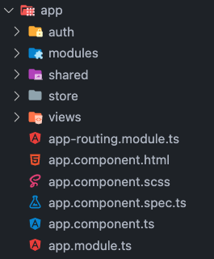
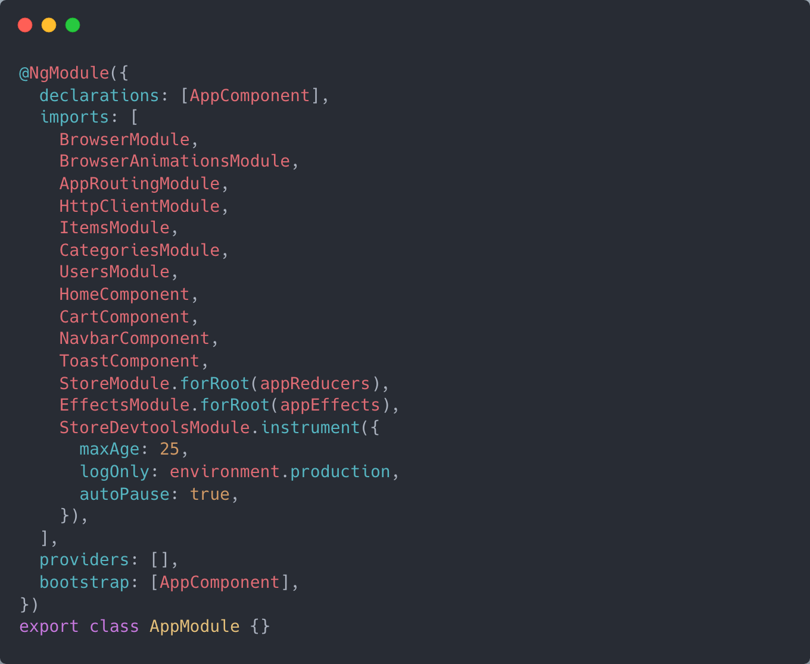

#### [Documentación completa](https://www.notion.so/foddie-app-ca835afd161c479ab934b8717093e7d0)

## Angular

He decidido utilizar Angular para montar el frontend de mi aplicación, principalmente por que es el que utilizado en el trabajo y por lo tanto más experiencia tengo, es un framework muy robusto ideal para construir proyectos grandes y duraderos, gracias a incorporar un sistema modular que prácticamente nos obliga a mantener una buena y sólida arquitectura.

**Ventajas de Angular:**

- Muy robusto
- Está hecho a prueba de errores, en gran parte a la integración nativa con TypeScript
- Ideal para aplicaciones de media/gran escala
- Es todo un entorno de desarrollo, a diferencia de React por ejemplo en el que tienes que instalar todo lo que necesites. Angular cuenta con casi todo lo que necesitas de base
- Ya empiezas con una buena arquitectura MVC y una forma de hacer las cosas
- La inyección de dependencias es de las mejores cosas que tiene Angular, pudiendo inyectar un servicio en un componente directamente desde el constructor

**Desventajas de Angular:**

- Es bastante pesado
- Necesitas hacer muchas cosas para tener un resultado
- A diferencia de React por ejemplo que considero que puede tener una curva de aprendizaje más sencilla, ya que es casi JavaScript puro y luego puede ser muy complejo cuando quieres hacer cosas más avanzadas, en Angular la curva de aprendizaje es pronunciada desde el principio.

### Qué son los módulos?

En Angular declaramos módulos para agrupar componentes, servicios, directivas, etc. Todo lo que queramos utilizar en un módulo deberemos importarlo en ese mismo módulo. Inicialmente la aplicación sólo viene con el módulo principal `app.module.ts` que podemos extender importando los módulos que vayamos creando posteriormente.

### Qué son los componentes?

Los componentes son una parte esencial de nuestra aplicación, nos permiten agrupar una parte de la lógica y la presentación de nuestra aplicación, por lo que la aplicación estará dividida en varios “trozos” que serán los componentes. Los componentes son reutilizables, se declaran en un módulo y podemos exportarlos para utilizarlos en otro módulo. Inicialmente la aplicación sólo viene con el componente principal `app.component.ts`. Un componente se puede dividir en **ts**, que sería una clase que contiene la lógica del componente, el **html**, que sería la estructura de elementos donde utilizaríamos las directivas que nos proporciona Angular para interactuar con la lógica (*ngIf, *ngFor, etc), y el **css** o **scss**, para añadir estilos.

Esta división no es obligatoria y podemos tenerlo todo junto en un archivo, dentro de la clase iría la lógica y en template y styles el html y los estilos, respectivamente.

### RxJs

Es una librería para construir aplicaciones asíncronas y basadas en eventos, contiene una serie de tipos con los que podemos trabajar y una gran cantidad de **operadores** para modificar su comportamiento. Angular la incorpora por defecto en su core, ya que es casi indispensable para la comunicación entre componentes. Principalmente utilizaremos los **Observables**, que representa una cadena de valores que se emiten a lo largo del tiempo y podemos ejecutar una lógica mediante el método **subscribe()**, que recibe los valores que emite el observable.

### NgRx

Es una librería que nos permite manejar un estado global para toda la aplicación mediante **actions**, que disparan un evento, **reducers**, que reaccionan a este evento y manipulan el estado como hayamos programado y **selectors**, que devuelven un observable con la parte de nuestro estado que queramos obtener. Adicionalmente están los **effects**, que resumiendo serían un método que se activa cuando disparamos una determinada **action**, y que devuelven otra **action**, los efectos pueden contener lógica y son ideales para recoger información de la API, ya puede recibir una acción y devolver otra dependiendo de si se ha podido realizar correctamente la petición o si ha devuelto algún error, esto se entenderá mejor en código.

### Tailwind CSS

Para estilar la aplicación estaré utilizando Tailwind, un framework CSS basado en utilidades, en lugar de componentes, esto nos permite crear nuestros propios componentes de forma más personalizada. Las utilidades son clases ya preparadas que aplican una o varias reglas CSS, hay tantas utilidades como reglas CSS o incluso más, por ejemplo “p-4”, aplicaría un padding de 16px. El hecho que ya haya medidas, tamaños de letra, colores, etc ya definidos, es que ya contamos con todo ese sistema de diseño que nos permite ser consistentes en nuestra aplicación. Una ventaja más es que nos quitamos la obligación de tener que escoger un nombre para cada clase que le queramos dar a un elemento, podemos poner directamente como queremos que se vea el elemento, y después, si vemos que se repite un patrón, podemos crear una clase para reducir el código repetido. Todo esto ha hecho que se convierta en mi forma preferida de estilar cualquier aplicación gracias a la agilidad y rapidez con la que nos permite llevar a cabo un diseño.

## Estructura del proyecto

He tratado de mantener una estructura lo más limpia posible para facilitar cualquier mantenimiento en el futuro.

Ahora voy a repasar cada una de las carpetas explicando su función y como he decidido su contenido.

Comencemos primero explicando el contenido del `AppModule`, el `AppComponent` que es donde comienza la aplicación, y después como están definidas las rutas en `AppRoutingModule`.

Aquí están importados todos los módulos que utiliza la aplicación, en principio solo se puede importar módulos, pero con la introducción de los **Standalone Components** en la última versión ha cambiado, más adelante profundizaré en estos componentes especiales.

app.module.ts

Debemos tratar de mantener el AppComponent lo más limpio posible, añadiendo en forma de componentes el contenido de la aplicación. Aquí se ve que la única lógica que se ejecuta es utilizar al servicio Auth para obtener el usuario del local storage si es que lo hubiese. En el template mostramos el componente navbar y el componente toast de forma fija, y el router-outlet, que decide el componente que se muestra según la ruta.

.png>)

app.component.ts

Aquí definimos las rutas principales de la aplicación, para cada ruta definimos el path y el componente que va a renderizar esa ruta, opcionalmente podemos utilizar un **Guard** para controlar el acceso a dicha ruta. Como se puede apreciar, la ruta admin no contiene la propiedad component, esto es porque en lugar de mostrar un componente, carga de forma **lazy** el módulo admin entero, esto significa que el bundle que se genera al compilar la aplicación no incluye todo el contenido de admin y solo se pide si se entra en esta ruta.

.png>)

app-routing.module.ts

**Store**

Contiene dos archivos que se encargan de agrupar los effects y los reducers de la aplicación, estos son los que registraremos en el AppModule

Aquí es donde añadimos individualmente cada reducer, he creado uno por módulo. Aunque no sea necesario y podría haber creado uno global, así queda todo más separado y fácil de mantener en el futuro. Después veremos en la explicación de los módulos la implementación de los actions, reducers y effects.

.png>)

app.reducers.ts

.png>)

app.effects.ts

**Auth**

La carpeta auth contiene los **guards** de la aplicación y un servicio con algunos métodos relacionados con la autenticación

Los **guards** son puertas de acceso que dejan pasar al usuario a una ruta en determinada dependiendo de si cumple una condición

Veamos primero el `AuthService`

El AuthService tiene la store de la aplicación inyectado en el constructor para poder utilizarlo. El primer método que tiene es el que hemos visto antes que se llamaba desde AppComponent, que comprueba si hay en el local storage un usuario junto al token, esto es porque cuando se hace login, lo guardamos también en el local storage, para que el usuario no pierda la sesión si refresca la página. Los otros métodos se utilizan para ser llamados desde los otros servicios de la aplicación y añadir el token a la cabecera de las peticiones que lo requieran.

.png>)

auth.service.ts

**Shared**

En la carpeta shared finalmente he decidido colocar aquellos componentes que se usan a lo largo de la aplicación pero no son parte de ningún módulo en concreto, todos ellos son **Standalone Components**, componentes que no necesitan de un módulo en el que ser declarado

Aunque los módulos de Angular funcionan muy bien, a veces son muy engorrosos cuando quieres crear un componente rápidamente, o cuando tienes varios componente que no forman parte de un módulo y tienes que empezar a crear un módulo para cada componente. Para este caso me ha encantado este nuevo enfoque de componentes, solo tienes que indicar **standalone true** en las opciones del componente y añadir en los **imports** lo que pienses utilizar dentro de ese componente.

.png>)

home.component.ts

**Admin**

He creado un módulo para la zona de admin, que contiene sus propias rutas y un par de componentes, en admin component se muestra el sidebar y un router outlet, que mostrará un componente u otro dependiendo de la ruta. El módulo es cargado de forma lazy

Desde las rutas se puede acceder a los componentes de productos, categorías y pedidos. Lo he configurado para que cuando entre en admin se redireccione a productos automáticamente, para que no muestre el sidebar sin un componente al lado.

.png>)

admin-routing.module.ts

### **Módulos**

Para la organización de los módulos he tratado de implementar una arquitectura hexagonal, he creado un módulo por cada entidad del dominio, cada uno contiene su carpeta para los componentes, otra para las interfaces que tengan relación con la entidad, el servicio para las llamadas a la api de esa entidad y el store con todos los actions, reducers, effects y selectors respectivos a esa entidad.

**Componentes**

Voy a coger como referencia el módulo de items por no explicarlos todos ya que son muy similares entre si, he tratado de mantenerlos lo más homogéneos posible.

Voy a comenzar explicando la carpeta components, como he distribuido la lógica y el estado y cómo los he comunicado entre ellos.

El componente principal es el que se encarga de mostrar el listado de items y manejar el estado, recogiendo todo lo necesario cuando se inicia el componente y con métodos que disparan las diferentes acciones de item.

Implementamos el método OnInit de Angular, aquí introducimos todo lo que queremos que se ejecute cuando el componente sea renderizado. En este caso, uso los selectores selectItems, para suscribirme al listado de items, selectCategories, porque necesitamos que al crear o actualizar un item aparezca un desplegable con las categorías disponibles, selectCart, para suscribirme al listado de items añadidos al carrito y poder mostrar la cantidad que hay añadida de cada item y selectAdmin, para mostrar los botones de editar o añadir items en caso que sea admin. Finalmente llamamos a getItems() para que dispare la acción que obtiene los items y si es admin disparamos la acción getCategories()

.png>)

items.component.ts

Para la comunicación entre el componente padre y los componentes hijos, he utilizado Inputs y Outputs, son una utilidad de Angular que nos permite recibir parámetros y enviar eventos.

Desde el componente padre se utiliza al componente hijo con la siguiente sintaxis en los parámetros, [] los inputs, () para los outputs.

.png>)

items.component.ts

Desde el componente hijo vemos que todos los métodos utilizan un output para emitir un valor y después en el padre trabajar con ese valor.

.png>)

item-card.component.ts

He creado un componente formulario para los items, y lo he reutilizado para poder usarlo al crear nuevos items o modificar uno existente. Lo primero es declarar los campos del formulario, he utilizado el módulo ReactiveForms de Angular para poder crear los formularios de un forma más programática. Indicamos el nombre del campo, su valor inicial y perdemos añadir también validadores, como que el campo sea requerido.

.png>)

items-form.component.ts

Para guardar el item extraigo los valores de los campos del formulario y emito un evento al componente padre, que es el que realmente interactuará con el store disparando la acción createItem.

.png>)

items-form.component.ts

Para poder utilizar el formulario al actualizar un item, he creado un Input que recibe un Item y le aplica al formulario los valores de las propiedades de ese item.

.png>)

items-form.component.ts

**Interfaces**

En interfaces encontramos, una para definir las propiedades del estado, otro para definir las propiedades de la misma entidad cuando nos llega del back, y comandos que definen las propiedades necesarias para disparar una determinada acción

**Servicio**

En la carpeta servicios encontramos un único archivo que es el que realiza las llamadas a la api. Para hacerlo utilizo el HttpClient de Angular, sería como el fetch de JavaScript pero potenciado, además devuelve directamente un observable en lugar de una promesa. Adicionalmente también inyectamos nuestro AuthService para añadir el header de autenticación con el token.

.png>)

**Store**

Para empezar con el store primero debemos definir el estado inicial de esta store.

El store de items contendrá las siguientes propiedades: **items**, lista de items que llega de la api,

**loading** y **loaded**, que sirven por ejemplo para mostrar un spinner mientras cargan los cambios, **error** y **message**, que almacenan el mensaje de error en caso de haber fallado la petición o mensaje de completado si se desea avisar al usuario que algo se ha realizado correctamente

.png>)

items.reducer.ts

Voy a mostrar como ejemplo el caso de uso de getItems, comenzando por los actions.

De cada action que tiene que hacer una llamada a la api creo tres actions, uno para que haga la petición, otro como resultado satisfactorio y otro por si falla la petición. El primero no recibe parámetros, el de error recibe el mensaje de error y el del resultado satisfactorio recibe los items.

.png>)

items.actions.ts

En el reducer programamos los cambios que van a realizar las acciones en nuestro estado, cuando se dispara getItems se indica que está cargando, si hay un error el estado pasa a tener ese mensaje de error y si sale bien se cambia la lista vacía por el resultado del servidor.

.png>)

items.reducer.ts

El efecto de getItems se activa cuando se dispara la acción getItems, este utiliza el servicio api de items y llama al método getItems(), como devuelve un observable, se mapea el resultado y se devuelve la acción getItemsSuccess que ha recibido los items como parámetro y si ha ocurrido algún error se recoge y se devuelve la acción getItemsError con el mensaje de error.

.png>)

items.effects.ts

Los selectores sirven para devolver una parte específica del store y no el store completo, se crean con la utilidad createSelector de ngrx. Aquí devuelvo del estado de items, solo el listado.

.png>)

items.selectors.ts

### **Usuarios**

Voy a explicar también el módulo de usuarios ya que se sale un poco de las reglas generales que se siguen en los otros módulos. Este módulo sigue teniendo su carpeta components, interface, service y store, además, también he añadido un routing para este módulo.

He declarado unas rutas para mostrar cada uno de los componentes declarados en este módulo, para tenerlos separados del resto de la aplicación, aunque no sería necesario. Este módulo tampoco sigue la estructura del resto de módulos ya que no tiene un componente padre que muestra a los hijos, todos estos componentes son independientes y están al mismo nivel, se muestran dependiendo de la ruta.

users-routing.module.ts

He creado algunos selectores para utilizarlos en los guards y en otros componentes.

%201.png>)

users.selectors.ts

He creado también un par de efectos para cuando el usuario hace login correctamente o cierra sesión se actualice la información del local storage y redirija al usuario al home o a la página de admin en caso de que sea usuario administrador.

Estos efectos son algo especiales porque no devuelven una acción, ya que lo único que quiero que hagan es redirigir al usuario, esto lo indico con la opción **dispatch: false**

%201.png>)

users.effects.ts
